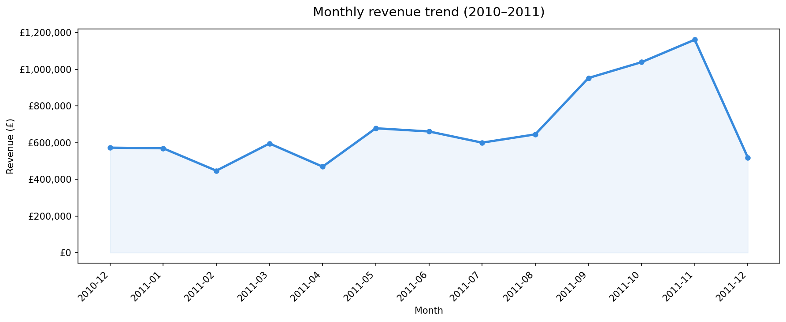
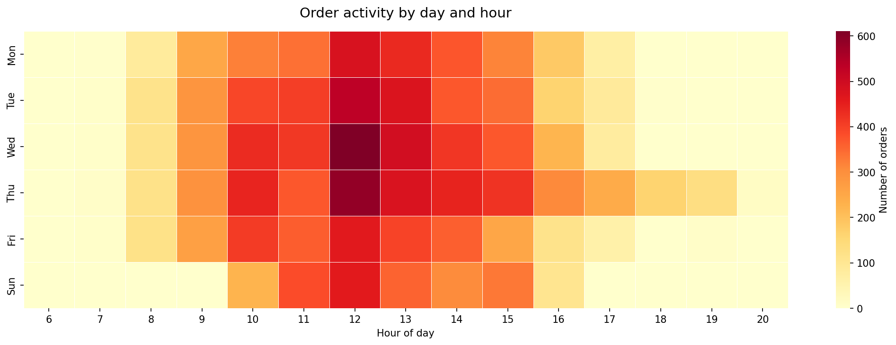
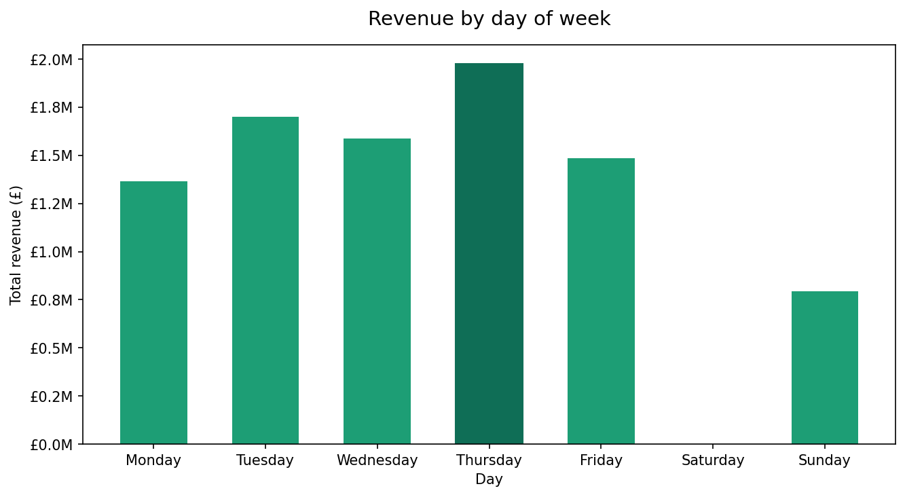
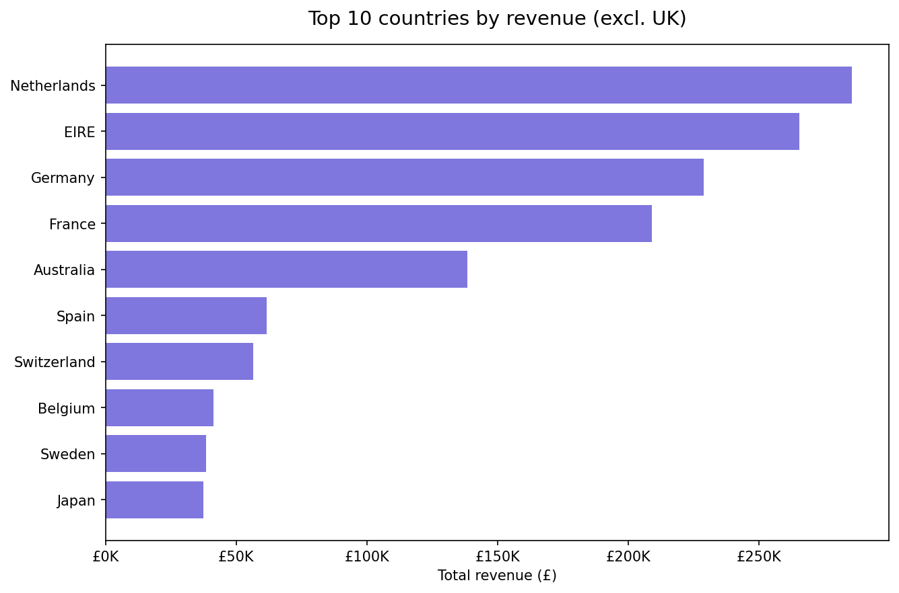
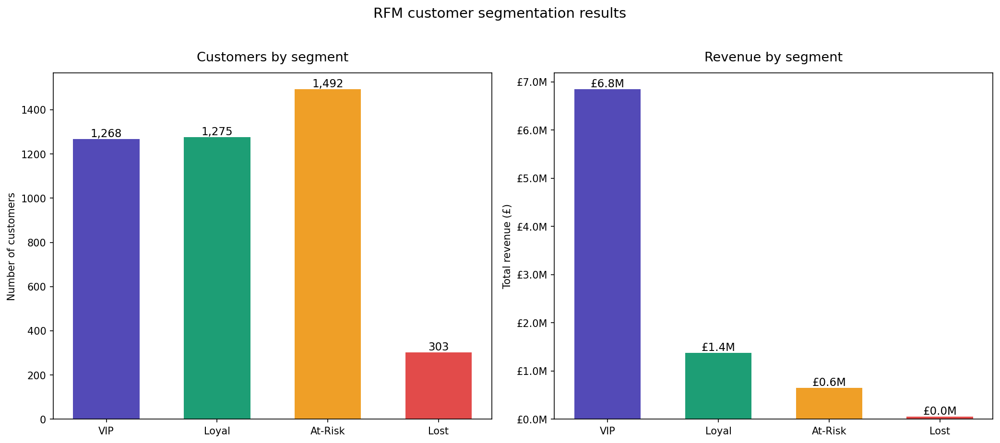
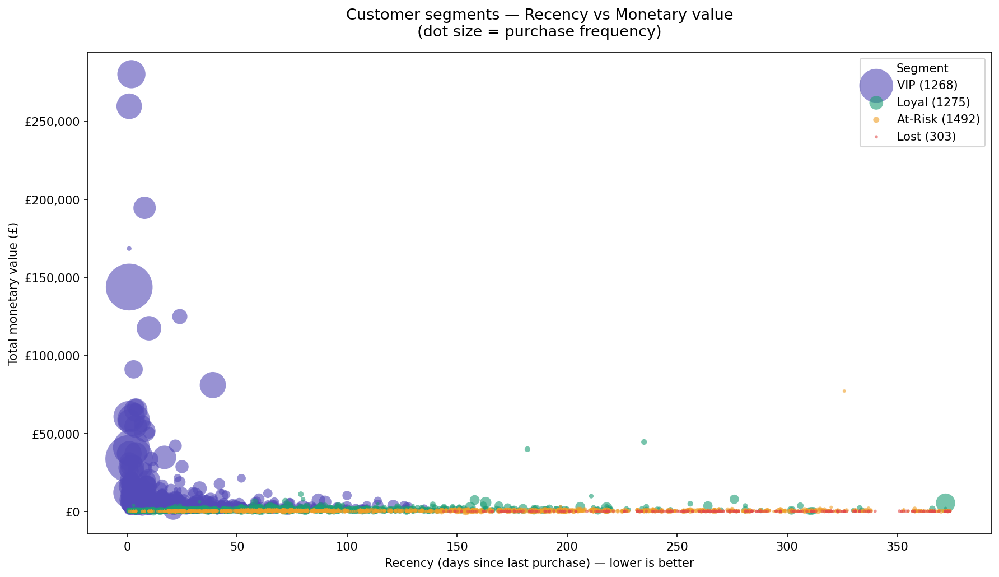

# E-Commerce Customer Analytics

Analysis of 500K+ real retail transactions from a UK-based online store
(UCI Online Retail Dataset, 2010–2011).

## What this project covers
- **Sales trend analysis** — monthly revenue, peak days, seasonal patterns
- **Customer segmentation** — RFM scoring to identify VIP, at-risk and new customers
- **Product analysis** — top products by revenue and return rates
- **Geographic breakdown** — revenue by country

## Key findings

### Sales trend analysis
- **Total revenue**: £8,911,408 across 18,532 orders from 4,338 customers
- **Peak month**: November 2011 — £1,161,817 (early holiday shopping spike)
- **Strongest day**: Thursday drives the highest weekly revenue
- **Peak hours**: 10am–3pm on weekdays — near zero on weekends
- **Top international market**: Netherlands leads all non-UK countries

### RFM customer segmentation
- **4,338 customers** scored across Recency, Frequency and Monetary dimensions
- **VIP customers** (29.2%) generate **76.8% of total revenue** — £6.8M of £8.9M
- **VIP behaviour**: avg 9.9 orders, last purchased just 20 days ago
- **At-Risk customers**: 1,492 customers (34.4%) averaging 146 days since last purchase
- **£645,858 revenue at risk** from At-Risk segment — prime re-engagement target

### Charts








## Tech stack
Python · Pandas · Matplotlib · Seaborn · Plotly · Jupyter

## Dataset
- Source: [UCI Machine Learning Repository](https://archive.ics.uci.edu/dataset/352/online+retail)
- 541,909 transactions · 8 columns · 38 countries
- License: CC BY 4.0

## How to run
```bash
git clone https://github.com/Sairam-Bodepudi/ecommerce-customer-analytics.git
cd ecommerce-customer-analytics
conda create -n ecommerce python=3.13 -y
conda activate ecommerce
pip install -r requirements.txt
jupyter notebook
```
